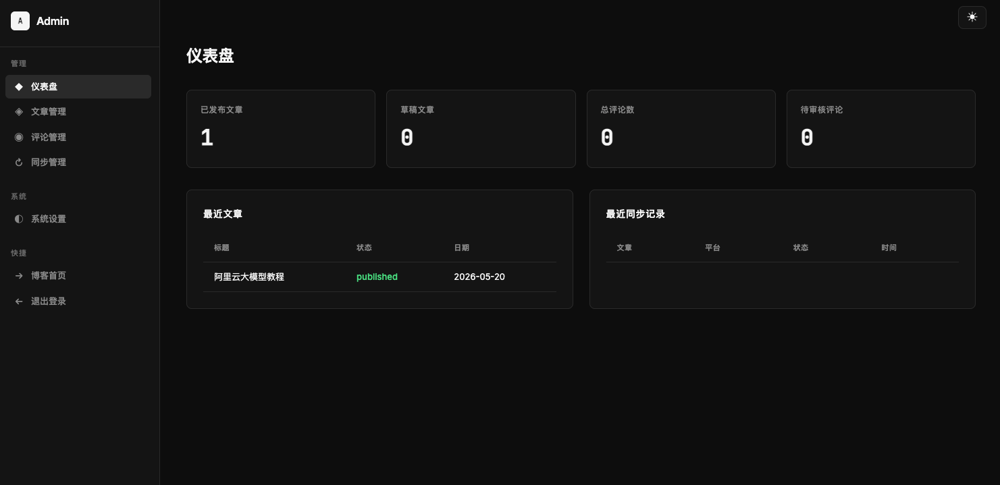
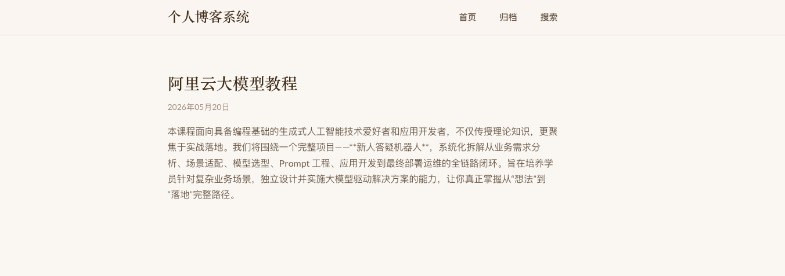

# 博客系统

基于 Python FastAPI + Jinja2 的个人博客系统。

## 功能特性

- 服务端渲染，SEO 友好
- 主题切换（亮色/暗色）
- Markdown 文章编辑与渲染
- 文章同步到 CSDN、微信公众号
- 评论系统（支持注册用户和匿名评论）
- 管理后台

## 界面预览
### 管理后台

### 首页


## 技术栈

- Python 3.11+
- FastAPI
- Jinja2
- SQLAlchemy
- SQLite

## 快速开始

1. 安装依赖：

```bash
pip install -r requirements.txt
```

2. 启动服务：

```bash
uvicorn app.main:app --reload --host 0.0.0.0 --port 8000
```

3. 访问 http://localhost:8000

## 默认管理员账号

- 用户名：admin
- 密码：admin123

## 目录结构

```
blog-python/
├── app/
│   ├── __init__.py
│   ├── main.py          # FastAPI 应用入口
│   ├── models.py        # 数据库模型
│   ├── schemas.py       # Pydantic 校验模型
│   ├── crud.py          # 数据访问层
│   ├── services/        # 服务层
│   │   ├── sync.py      # 同步服务
│   │   └── adapters/    # 平台适配器
│   ├── templates/       # Jinja2 模板
│   └── static/          # 静态资源
├── config.py            # 配置文件
├── requirements.txt     # 依赖
└── doc/
    └── development_design.md  # 设计方案
```